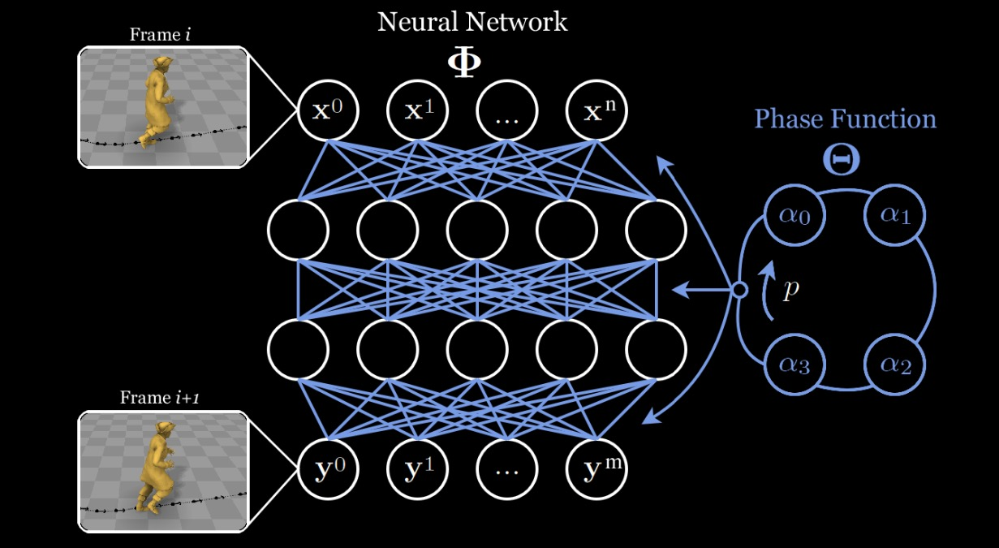
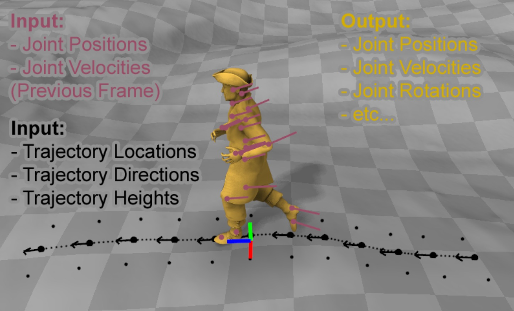

# Phase-Functioned Neural Networks 
### for Character Control

---

DANIEL HOLDEN, TAKU KOMURA, JUN SAITO

---

## Resources

[paper](https://www.pure.ed.ac.uk/ws/files/35467734/phasefunction.pdf)

[project page](http://theorangeduck.com/page/phase-functioned-neural-networks-character-control)

---

## Research Goal

Fast, compact, expressive character controller for games

---

#### Prior Work  - Motion Graph Matching 

- Uses a large library of recorded motion in memory
- Lots of manual processing
- difficult acceleration matching
- **Not Scalable**

---

#### Prior Work - Neural Networks, CNNs, RNNs

- Ambiguity - same input control maps to multiple different motions
- Whole input trajectory must be given beforehand
- CNN too slow for games
- RNNs decay or explode

---

# key idea

--

## Character locomotion is periodic

### Arguably Quasi-periodic

--

## Phase-Functioned Neural Networks (PFNN)

--

#### The weights of the network are a function of phase

An external variable representing timing of the motion cycle

--

The function which generates the weights of the regression network which performs the control task.

--

Dynamically **changing the network weights**  
as a function of the phase instead of keeping them static, as 
in standard neural networks, significantly increases 
the expressiveness of the regression while retaining the compact structure.

---

## Data 4.1

- Lots of motion capture...
- Phase labelling
- semantic gait labels (running, walking..)
- terrain labels
- all mirrored

--

## Terrain 4.2

- motions that climb up and over obstacles
- mesh patches that touch character's feet
- join patches
- allow for jumping

--

## Input and Outputs

- input is previous pose and user control
- output is new pose, new phase, and some other params...

--

## Input and Outputs

---

## Net Architecture

Quite conventional, except activation is ELU

Exponential Linear Unit

---

## Phase function

Cubic Catmull-Rom Spline

end point = start point

---

## Training

Normalised weights, but scaled joints down to make trajectory dominant.

Regularisation L1 to encourage sparse small weights.

Adam

---

## Test time 6

Trajectories from controller

Semantics from controller

Plus some influence from current trajectory 

---

## Phase function

Pre compute to trade speed for memory.
Or not...

---

## Results and Evaluations

Qualitative renders... 

Compare other methods and show problems

some time and memory comparisons

proximity to pre defined paths...

---

<video width="960" height="540" controls="controls">
  <source 
  src="http://theorangeduck.com/media/uploads/other_stuff/phasefunction.mov" type="video/mp4">
</video>

---

## Notes

I glossed over the terrain fitting...

---

# Questions

